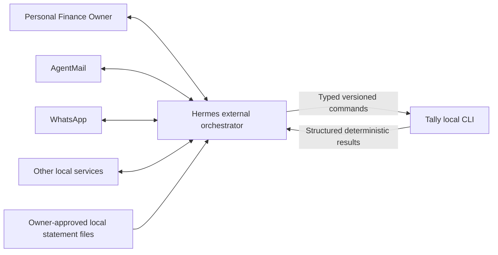
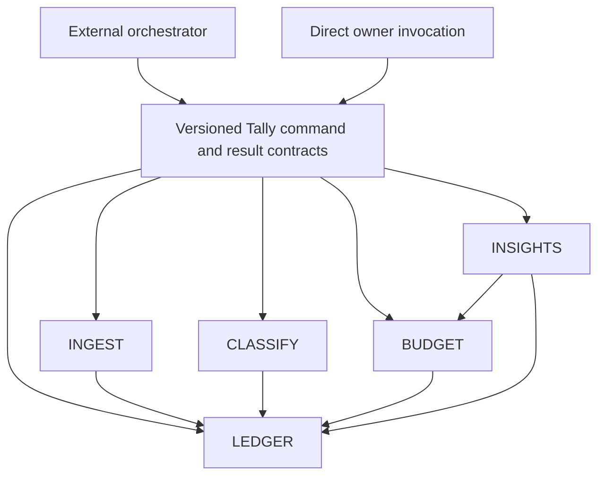

# Tally System Context and Trust Boundary

> Generated from the lex graph. Do not edit this file as source of truth; update graph entities and re-export.

**Ref Code:** ARCH-CORE-TALLY-SYSTEM-CONTEXT

> Origin: ADR-CORE-0030 and cross-module Tally documentation review

## Purpose

Tally is the provider-neutral financial system of record for one local owner. It accepts typed commands, applies deterministic financial rules, persists durable audit history, and returns structured results. It does not own a mailbox, messaging account, conversation, schedule, recipient policy, or delivery lifecycle.

Hermes is a separate external orchestrator. It connects the owner and provider-specific services to Tally without moving financial invariants out of Tally. This separation is governed by ADR-CORE-0030 and is the target for the next module revisions. Conflicting module text is historical design input, not authority to weaken the boundary.

## System context

The owner interacts through Hermes or may invoke Tally directly. AgentMail, WhatsApp, and other providers are outside the Tally trust and runtime boundary. Hermes may read provider payloads, extract facts, ask the owner for clarification, select Tally operations, and render results. Tally validates every request as a financial operation and never treats Hermes as authority to bypass domain rules, explicit approvals, idempotency, or audit history.

Tally remains a local command-line application with no required daemon, inbound listener, provider credentials, or delivery integration. Even on the same host, Hermes invokes only released Tally contracts and never accesses Tally storage directly.

## Responsibility map

| Concern | Tally | Hermes |
|---|---|---|
| Canonical accounts, transactions, categories, corrections, relationships, and exact money | Owns | Does not reproduce |
| Evidence metadata, opaque external references, reconciliation decisions, and audit history | Owns | Supplies facts and references |
| Deterministic classification, budget positions, and insight metrics | Owns | Requests and consumes |
| AgentMail polling, MIME parsing, mailbox cursors, sender controls, and acknowledgement | Does not own | Owns |
| Clarification conversation and owner response collection | Returns structured needs and accepts typed answers | Owns interaction |
| Schedules, threshold policy, recipient disclosure, rendering, throttling, delivery, and retries | Does not own | Owns |
| Provider credentials, raw provider payloads, and provider delivery state | Does not store | Owns and protects |
| Financial mutation authorization and invariants | Enforces at every command | Cannot bypass |

Provider-specific identifiers may enter Tally only as opaque external references attached to privacy-conscious evidence metadata. Their structure has no meaning inside Tally. Mailbox or MIME payloads, WhatsApp content, provider cursors, allowlists, credentials, and delivery attempts remain outside Tally.

## Internal module map

- **LEDGER** is authoritative for canonical financial facts and histories. Its target revision adds generic evidence linkage, reconciliation, and stable payment-instrument or cardholder attribution where needed.
- **INGEST** parses explicitly supplied statement artifacts and performs match-first reconciliation through public LEDGER contracts. It never polls a mailbox. Strong matches link statement evidence to an existing transaction; missing matches create statement-only transactions; ambiguous or absent cases become structured exceptions.
- **CLASSIFY** evaluates eligible canonical transactions locally and deterministically. It previews first and applies only explicit owner-approved changes through public LEDGER operations. It does not infer provider behavior.
- **BUDGET** owns plans and exact planned, actual, remaining, and over-budget results by spend pool and category. It consumes canonical attribution rather than provider wording.
- **INSIGHTS** produces channel-neutral, deterministic weekly, month-to-date, and exception results with cited evidence. It does not schedule, notify, select recipients, or render channel-specific copy.

No Tally domain module depends on Hermes, AgentMail, WhatsApp, or another provider. Dependencies point inward toward stable Tally financial contracts. The external orchestrator depends on those public contracts, not the reverse.

## Core interaction flows

### Notification-derived transaction

1. Hermes receives a provider notification, protects the raw payload, and extracts candidate financial facts.
2. Hermes asks the owner for any clarification needed before mutation.
3. Hermes invokes a typed LEDGER command with provider-neutral facts, an evidence kind such as agent capture or owner assertion, and an opaque external reference.
4. LEDGER validates the financial command, registers evidence idempotently, records at most one canonical transaction, and returns a structured result.
5. Hermes renders or delivers that result. Tally records no delivery state.

### Statement reconciliation

1. Hermes or the owner supplies an approved local statement artifact to an explicit INGEST preview operation.
2. INGEST parses statement rows and queries the public LEDGER reconciliation projection.
3. INGEST proposes only deterministic strong matches. An approved commit links statement evidence and records a reconciliation decision without creating a second canonical transaction.
4. A row with no compatible prior transaction creates one statement-only transaction. Ambiguous candidates remain unapplied. Previously recorded transactions absent from the statement become reconciliation exceptions.
5. INGEST returns a durable batch summary, receipts, and exception list. Hermes decides when and how to request owner review.

### Scheduled reporting

1. Hermes owns the schedule and invokes BUDGET or INSIGHTS through a typed query.
2. Tally returns exact structured values, evidence states, and deterministic exceptions without recipient or channel fields.
3. Hermes applies recipient-specific disclosure, formatting, throttling, and WhatsApp or other delivery policy.

## Contract and failure boundary

Tally contracts are versioned, discoverable, machine-readable, and deterministic. Requests contain domain facts, stable Tally identifiers, idempotency keys, evidence kinds, and opaque references. Results contain typed success or failure states, stable identifiers, exact values, reconciliation summaries, and review needs. Human prose is explanatory output only; Hermes never has to scrape it to decide what happened.

Transport success is not financial success, and financial success is not delivery success. A provider retry may repeat a Tally request, so mutations and evidence registration must be idempotent. A committed Tally result remains committed if Hermes crashes before delivery. Hermes may safely replay the same logical request and recover the original outcome; it may not silently reinterpret or duplicate it.

Ambiguity is a first-class result. Tally blocks or reports uncertain financial matches and returns the evidence needed for review. Hermes owns the conversation that obtains an explicit owner decision, then submits that decision through a typed Tally command. Neither system guesses on the owner's behalf.

## Privacy and security boundary

Tally stores only the financial state and evidence metadata needed for deterministic history, reconciliation, correction, and reporting. It does not store mailbox bodies, MIME parts, messaging transcripts, delivery receipts, provider credentials, recipient lists, or provider retry state. Diagnostics contain identifiers and safe counts, never raw financial or provider payloads.

Hermes protects provider secrets and raw communications. When it invokes Tally under the trusted local owner identity, Tally still validates operation shape, state transitions, idempotency, and explicit-approval requirements. If deployment expands beyond the current single-owner local boundary, authentication, authorization, multi-user disclosure, and service isolation require new project decisions.

## CHANNELS disposition

CHANNELS is not a deployable Tally component and must not own runtime behavior. During documentation migration it may temporarily name the external-consumer seam, but references that say CHANNELS owns screens, conversation, scheduling, notification, or delivery should be rewritten as external orchestration responsibilities. Once no Tally contract or design depends on CHANNELS as an internal module, the placeholder may be removed from the implementation graph.

## Governing invariants

- One economic event has at most one canonical transaction even when multiple evidence records describe it.
- Evidence registration and reconciliation decisions are replay-safe and auditable.
- Deterministic matches may apply automatically only when documented evidence is sufficient; ambiguous matches require explicit owner approval.
- Corrections, refunds, reversals, transfers, reconciliation, and classification preserve exact pool and category actuals.
- Tally returns structured financial truth and review needs; Hermes owns timing, conversation, disclosure, and delivery.
- No provider name, payload format, recipient, or delivery mechanism becomes a Tally domain rule.

## See Also

- [MD-LEDGER-MASTER — Provider-neutral financial ledger technical design](../../designs/ledger/design.md) (references)
- [MD-INSIGHTS-MASTER — Budget Insights technical design](../../designs/insights/design.md) (references)
- [MD-INGEST-MASTER — Statement Ingestion technical design](../../designs/ingest/design.md) (references)
- [MD-CLASSIFY-MASTER — Transaction Classification technical design](../../designs/classify/design.md) (references)
- [MD-BUDGET-MASTER — Budget Planning technical design](../../designs/budget/design.md) (references)
- [EXT-INSIGHTS-CHANNELS-CONSUMER-CONTRACT — CHANNELS Consumer Contract](../../prd/insights/prd.md#ext-insights-channels-consumer-contract-channels-consumer-contract) (references)
- [ADR-CORE-0030 — Keep Tally provider-neutral and delegate transport orchestration to Hermes](../../adr/core/0030-keep-tally-provider-neutral-and-delegate-transport-orchestration-to-hermes.md) (references)
- [UC-LEDGER-018 — Maintain Spend Pool and transaction Pool Assignment](../../prd/ledger/prd.md#uc-ledger-018-maintain-spend-pool-and-transaction-pool-assignment) (references)
- [UC-LEDGER-017 — Maintain Payment Instrument and Cardholder Attribution](../../prd/ledger/prd.md#uc-ledger-017-maintain-payment-instrument-and-cardholder-attribution) (references)
- [UC-LEDGER-016 — Review statement coverage exceptions](../../prd/ledger/prd.md#uc-ledger-016-review-statement-coverage-exceptions) (references)
- [UC-LEDGER-015 — Resolve or correct a Reconciliation Decision](../../prd/ledger/prd.md#uc-ledger-015-resolve-or-correct-a-reconciliation-decision) (references)
- [UC-LEDGER-014 — Reconcile statement evidence to a Canonical Transaction](../../prd/ledger/prd.md#uc-ledger-014-reconcile-statement-evidence-to-a-canonical-transaction) (references)
- [UC-LEDGER-013 — Register and link additional transaction evidence](../../prd/ledger/prd.md#uc-ledger-013-register-and-link-additional-transaction-evidence) (references)
- [UC-LEDGER-006 — Discover and invoke the External Orchestrator contract](../../prd/ledger/prd.md#uc-ledger-006-discover-and-invoke-the-external-orchestrator-contract) (references)
- [RISK-LEDGER-005 — Boundary drift could pull provider transport, conversation, scheduling, or delivery into Ledger, or let Hermes reproduce financial rules, creating two sources of truth and avoidable service coupling.](../../prd/ledger/prd.md) (see-also)
- [EXT-LEDGER-AI-AGENT-HOST — External Orchestrator](../../prd/ledger/prd.md#ext-ledger-ai-agent-host-external-orchestrator) (references)
- [DD-LEDGER-APPLICATION-ARCHITECTURE — Single-process provider-neutral vertical slices with selective ports](../../designs/ledger/decisions/application-architecture.md) (references)
