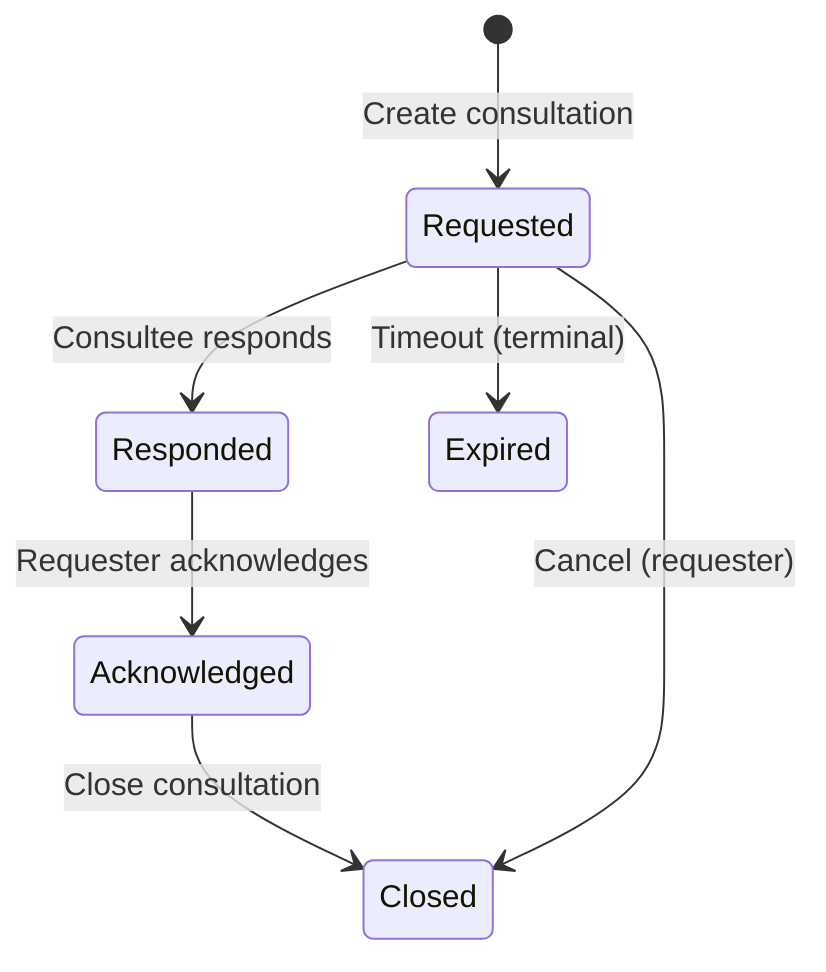

# Consultation Lifecycle State Machine

> Generated from the lex graph. Do not edit this file as source of truth; update graph entities and re-export.

**Diagram Type:** workflow
**Format:** mermaid

## Content

