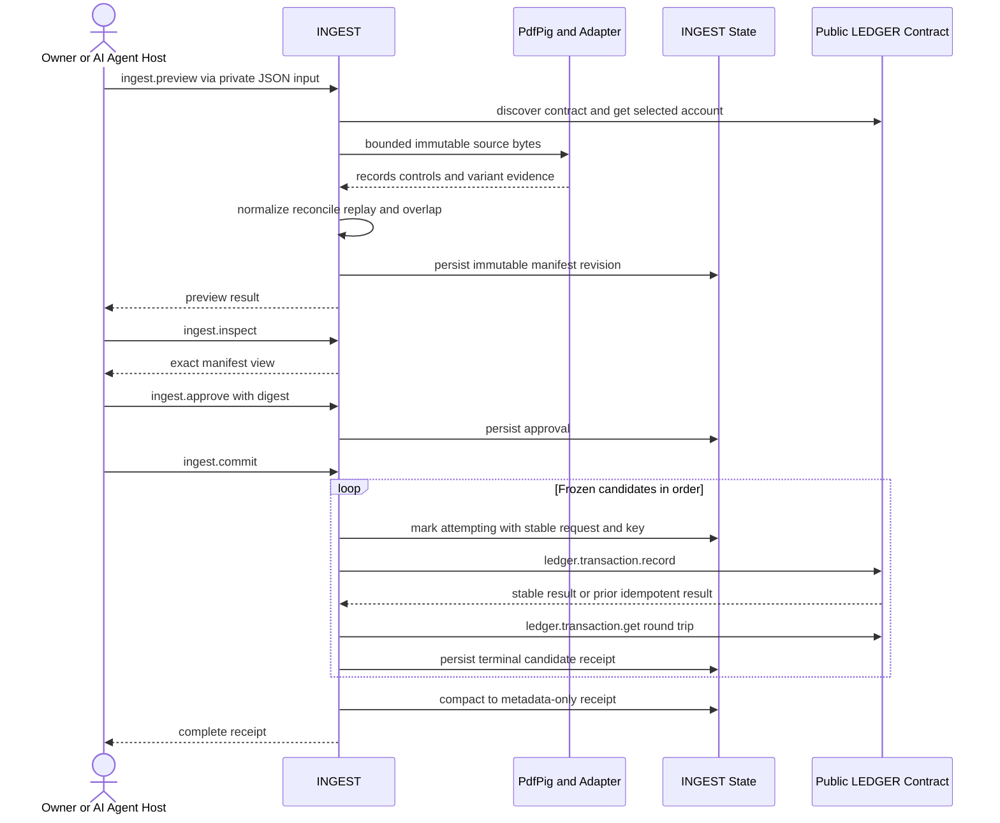

# Preview approval commit and receipt sequence

> Generated from the lex graph. Do not edit this file as source of truth; update graph entities and re-export.

**Diagram Type:** sequence
**Format:** mermaid

## Content

