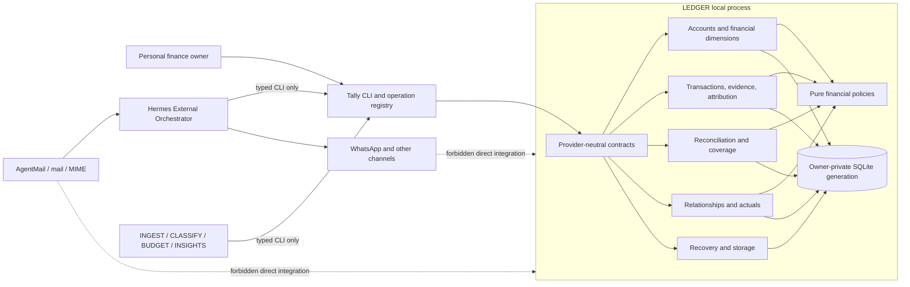

# Provider-neutral LEDGER component architecture

> Generated from the lex graph. Do not edit this file as source of truth; update graph entities and re-export.

**Diagram Type:** c4_component
**Format:** mermaid

## Content

