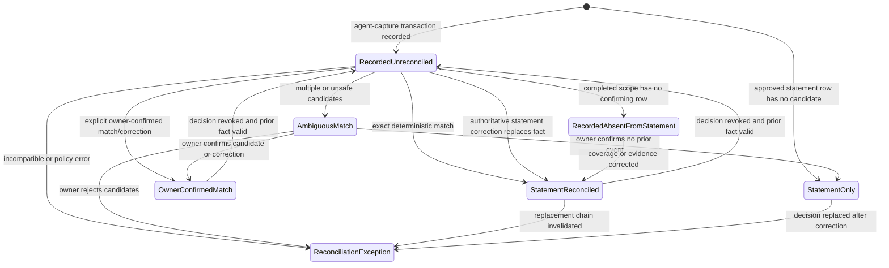

# Provider-neutral reconciliation lifecycle

> Generated from the lex graph. Do not edit this file as source of truth; update graph entities and re-export.

**Diagram Type:** state
**Format:** mermaid

## Content

